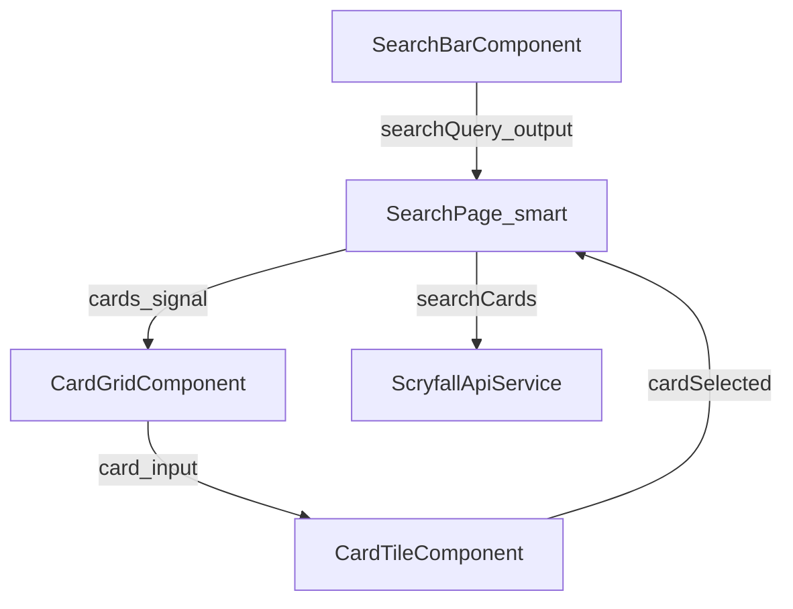

# Foil Vault Search — Implementation Exercises

A phased learning path for building a Scryfall card search app in Angular. Complete phases in order; each builds on the last.

**Parallel track:** See [EXERCISES-TESTING.md](./EXERCISES-TESTING.md) for Jasmine/Karma tests to un-skip as you go.

**Audience:** Comfortable with TypeScript, JavaScript, and React — new to Angular. You do not need prior RxJS, DI, or template syntax experience; each phase introduces only what you need for that step.

**How to use these guides:** Each phase has detailed step-by-step instructions with copyable snippets. After each code block you will see three short notes:

| Label | Meaning |
| ----- | ------- |
| **Why** | The design decision — why this code belongs here and not somewhere else |
| **What** | What the snippet does in plain language |
| **How it works** | Runtime mechanics — when it runs, what triggers it, what data flows where |

If you already understand a step, skip ahead to **Manual verify**. Prefer reading the scaffold’s `// TODO(learn):` and `@if (false)` EXAMPLE blocks alongside this doc.

**If already done:** Phases 1–2 (and matching tests T1–T2) may already be implemented in this repo. Those sections start with a skip note — jump to **Manual verify**, then continue.

**Runtime note:** This is a **pnpm monorepo**. All file paths below are **repo-root paths** (e.g. `apps/web/src/app/...`). `pnpm start` runs a local Fastify + SQLite mirror (`apps/api`, port **3000**) beside Angular (port **4200**). `SCRYFALL_API_BASE_URL` points at that local API — same `/cards/search` and `/cards/:id` shapes as Scryfall, without browser 429s. Card images still come from Scryfall’s CDN.

**Repo layout:**

```
apps/web/                    Angular app (this guide)
  src/app/                   features, core services, specs
  src/assets/                fixtures and static assets
  angular.json               Angular CLI config
apps/api/                    Local SQLite mirror (see apps/api/README.md)
data/                        Optional cards.sql dump for fast API boot
```

---

## React → Angular cheat sheet

Use this when something feels unfamiliar. You already know the concepts — Angular names them differently.

| You know (React)                        | Angular equivalent                                     | Where you'll see it                |
| --------------------------------------- | ------------------------------------------------------ | ---------------------------------- |
| `function App()` component              | `@Component({ ... }) class`                            | Every `.component.ts` / `.page.ts` |
| `props`                                 | `@Input()` or `input()` (signals)                      | Child components                   |
| `onSearch={fn}` callback props          | `@Output()` or `output()` + `.emit()`                  | Search bar → parent                |
| `useContext` / prop drilling            | **Dependency injection** — `inject(Service)`           | Services, route, HTTP              |
| Custom hook (`useSearchCards`)          | **Injectable service** (`@Injectable`)                 | `ScryfallApiService`               |
| `fetch` / `axios`                       | **`HttpClient`** (returns `Observable`, not `Promise`) | `apps/web/src/app/core/services/scryfall-api.service.ts` |
| `useEffect(() => { fetch... }, [id])`   | **`ngOnInit()`** + `.subscribe()`                      | `apps/web/src/app/features/card-detail/card-detail.page.ts` |
| React Router `<Route path="/card/:id">` | **`Router` + route config** in `apps/web/src/app/app.routes.ts` | Lazy-loaded feature routes |
| `useParams()` / `useSearchParams()`     | **`ActivatedRoute`** — `paramMap`, `queryParamMap`     | Search + detail pages              |
| `useNavigate()`                         | **`Router.navigate()`**                                | Tile click → detail                |
| `location.state` on navigate            | **`Router.navigate(..., { state: { card } })`**        | Pass card without re-fetch         |
| JSX `{items.map(...)}`                  | **`@for (item of items(); track item.id)`**            | Templates (`.html` or inline)      |
| `@/` imports                            | **`@/` not used** — relative imports within `apps/web/src/app/` | All feature files           |
| Vite / CRA dev server                   | **`ng serve`** via **`pnpm start`** (API + web)        | Root `package.json` scripts        |
| Jest + React Testing Library            | **Jasmine + Karma + TestBed**                          | `*.spec.ts` files                  |

**RxJS in one paragraph:** Angular HTTP returns `Observable<T>` instead of `Promise<T>`. For now, treat `.subscribe({ next, error })` like `.then()` / `.catch()`. You call the service, subscribe in the component, and assign or log the result. Deeper operators (`switchMap`, `debounceTime`) appear in later phases and Stretch.

**DI in one paragraph:** Instead of importing a hook, you declare `private readonly api = inject(ScryfallApiService)` inside a class. Angular's injector creates or reuses the service instance. In tests, you override providers to inject mocks — see [EXERCISES-TESTING.md](./EXERCISES-TESTING.md) T1b.

---

## How the two tracks fit together

Each app phase adds behavior; the matching test phase proves it. Work in this order:

1. Complete the **app phase** (implement the feature).
2. Complete the **test phase** with the same number (un-skip and write the spec).
3. Run **`pnpm test`** — fix any collateral breakage before moving on (see testing doc **T1b** after App Phase 1).

If tests fail after an app change, that is normal in Angular: components that start calling services need matching test setup. The testing guide calls out when to expect this.

| App phase       | Test phase   | Main thing you prove                         |
| --------------- | ------------ | -------------------------------------------- |
| 0 Orientation   | T0           | Tests run; read a spec file                  |
| 1 `getCardById` | T1 + **T1b** | HTTP service call; mock service in page spec |
| 2 `searchCards` | T2           | Search HTTP + error handling                 |
| 3 Search UI     | T3           | Component inputs/outputs                     |
| 4 URL state     | T4           | Router query params + search wiring          |
| 5 Detail UI     | T5           | Page integration with mocked API             |
| 6 Syntax guide  | (optional)   | Smoke tests only unless you add specs        |
| Stretch         | T6           | Timers, cache, debounce                      |

### Search page checklist map (ignore the mixed TODO list)

The placeholder checklist inside `apps/web/src/app/features/search/search.page.ts` mixes several phases. Use this map instead:

| Checklist item                          | Phase                           |
| --------------------------------------- | ------------------------------- |
| Wire SearchBarComponent                 | **3**                           |
| Call `ScryfallApiService.searchCards()` | **3**                           |
| Sync `q` and `page` to URL query params | **4**                           |
| Add `mat-paginator`                     | Stretch                         |
| Handle loading / empty / error states   | 3 (basic) / Stretch (skeletons) |
| Navigate to `/card/:id` on tile click   | **4**                           |
| Debounced query (~300ms)                | **Stretch** (not Phase 3)       |

---

## Phase 0 — Orientation

### Goal

Run the app, explore the scaffold, and find TODO markers so you know where work lives.

### In scope / out of scope

| In scope                      | Out of scope               |
| ----------------------------- | -------------------------- |
| Install, run, navigate routes | Implementing HTTP or UI    |
| Skimming files and TODOs      | Writing tests (that is T0) |

### Files to explore

- `apps/web/src/app/app.routes.ts` — like a React Router route table; features are lazy-loaded
- `apps/web/src/app/app.config.ts` — app-wide providers (`provideHttpClient`, router, etc.) — similar to wrapping `<App>` with context providers
- `apps/web/src/app/core/models/scryfall.types.ts` — complete Scryfall interfaces (plain TypeScript)
- `apps/web/src/app/features/` — placeholder pages and components (one folder per route/feature)
- `apps/web/src/assets/fixtures/` — sample JSON for offline UI work

### Concepts you need

**Standalone component:** Every `.ts` file with `@Component({ ... })` is a self-contained unit. It lists its own `imports: [...]` (Material modules, child components). There is no single `App.tsx` that imports everything.

**Template location:** Many components use an inline `template: \`...\`` string in the same file as the class (instead of a separate JSX file). That is intentional for this learning project.

### Step-by-step

1. Run `pnpm start` and open http://localhost:4200 (API must reach `http://localhost:3000/health` first; first boot may download/shred Scryfall bulk data)
2. Click **Search** and **Syntax Guide** in the toolbar — all routes should load without console errors
3. Visit `/card/any-uuid-here` — the route param should appear on the page subtitle
4. Search the codebase under `apps/web/` for `TODO(learn)` comments — those are your implementation markers
5. Open `apps/web/src/app/features/search/search.page.ts` and skim:
   - The `@Component` decorator
   - `imports: [...]`
   - The inline `template:`
   - The class export at the bottom
6. Open one child with signal I/O, e.g. `apps/web/src/app/features/search/components/search-bar/search-bar.component.ts` — note `input()` and `output()` at the bottom of the class (typed props + callback props)

### Manual verify

- App compiles
- Three main routes navigate (`/search`, `/card/:id`, `/syntax`)
- No console errors on initial load

### Common mistakes

- Expecting a single root JSX tree — Angular composes via each component’s `imports`
- Editing files under `dist/` or looking for `.jsx` — everything is `.ts` with templates

### Next

Do testing **T0**, then continue to Phase 1.

**Docs:** [Angular standalone components](https://angular.dev/guide/components), [Scryfall API](https://scryfall.com/docs/api)

---

## Phase 1 — First HTTP call

> **If already done:** If `getCardById` already uses `this.http.get` and the detail page already logs card JSON for a real UUID, skip to **Manual verify**, then do **T1 + T1b**.

### Goal

Implement `getCardById()` and see real card JSON in the browser console.

### In scope / out of scope

| In scope                                   | Out of scope                         |
| ------------------------------------------ | ------------------------------------ |
| `ScryfallApiService.getCardById` HTTP call | Rendering a full detail UI (Phase 5) |
| Temporary `console.log` on the detail page | Search API (Phase 2)                 |

### Files to edit

- `apps/web/src/app/core/services/scryfall-api.service.ts`
- `apps/web/src/app/features/card-detail/card-detail.page.ts`

### Concepts you need

- **`inject(HttpClient)`** — Angular creates `HttpClient` for you (already wired in `apps/web/src/app/app.config.ts` via `provideHttpClient`)
- **`Observable`** — HTTP does not run until you `.subscribe(...)` (unlike `await fetch`)
- **`ngOnInit`** — lifecycle hook that runs once after the component is created (≈ `useEffect` with `[]`, but without cleanup yet)

### Step-by-step

1. **Service only first** — In `apps/web/src/app/core/services/scryfall-api.service.ts`, find `getCardById`. Replace any stub/`throwError` with:

   ```ts
   return this.http.get<ScryfallCard>(`${SCRYFALL_API_BASE_URL}/cards/${id}`);
   ```

   **Why:** HTTP belongs in an injectable service, not in a component. That keeps pages thin and lets T1 test the URL and response shape in isolation.
   **What:** Sends `GET /cards/:id` to the local mirror (`SCRYFALL_API_BASE_URL`, default `http://localhost:3000`).
   **How it works:** `HttpClient.get` returns a cold `Observable<ScryfallCard>`. Nothing hits the network until a subscriber calls `.subscribe()`. The generic types the JSON body as `ScryfallCard`.

   `HttpClient` is already available as `this.http` via `inject(HttpClient)`. `SCRYFALL_API_BASE_URL` is imported from `apps/web/src/app/core/constants/scryfall.constants.ts` and defaults to the **local mirror** (`http://localhost:3000`), not `https://api.scryfall.com`.

2. **Wire the page** — In `apps/web/src/app/features/card-detail/card-detail.page.ts`:
   - Inject the service (same pattern as `inject(ActivatedRoute)`):

     ```ts
     private readonly scryfallApi = inject(ScryfallApiService);
     ```

     **Why:** Components should not construct services with `new` — Angular's injector provides a shared instance and tests can swap in mocks (T1b).
     **What:** Gives the page access to `getCardById`.
     **How it works:** `inject()` runs when the class is constructed by Angular. The field is `readonly` so the reference never changes, only the data inside the Observable does.

   - Ensure the class implements `OnInit` and has `ngOnInit(): void { ... }`
   - Inside `ngOnInit`, if you have a real `cardId`, call:

     ```ts
     this.scryfallApi.getCardById(this.cardId).subscribe({
       next: (card) => console.log("Scryfall card:", card),
       error: (err) => console.error("Failed to load card:", err),
     });
     ```

     **Why:** `ngOnInit` runs once after the route param is available — the right place for a first load (like `useEffect` with `[id]`).
     **What:** Subscribes to the card-by-id request and logs success or failure.
     **How it works:** `.subscribe({ next, error })` starts the HTTP call. `next` runs when JSON arrives; `error` runs on 404/network failure. For now you only log — UI comes in Phase 5.

   The route param is already read as something like:

   ```ts
   readonly cardId = this.route.snapshot.paramMap.get('id') ?? '(none)';
   ```

   **Why:** The `:id` segment in `/card/:id` is how you know which card to fetch.
   **What:** Reads the UUID from the current route once at construction time.
   **How it works:** `ActivatedRoute.snapshot.paramMap` is a synchronous snapshot. Phase 5 may also react to param changes; for Phase 1 a snapshot is enough.

3. **Do not build the full UI yet** — leave placeholder children as-is. UI is Phase 5.

### Manual verify

1. Ensure `pnpm start` finished ingest (`GET http://localhost:3000/health` returns `{ ok: true, cards: … }`)
2. Visit `/card/91fdb56b-54d5-4272-8319-505ff987fe9b` (Sol Ring — present in oracle-cards after ingest)
3. Open DevTools → Console
4. You should see a card object with `"name": "Sol Ring"` (or similar)

### Common mistakes

| Symptom                                            | Fix                                                               |
| -------------------------------------------------- | ----------------------------------------------------------------- |
| Nothing logs                                       | You forgot `.subscribe()` — Observables are lazy                  |
| `NullInjectorError: HttpClient` in the **app**     | Check `provideHttpClient()` exists in `apps/web/src/app/app.config.ts` |
| `NullInjectorError` in **tests** after this change | Expected — do **T1b** next                                        |
| Network error / connection refused                 | Local API not up — use `pnpm start` (not web alone)               |
| Wrong UUID / 404                                   | Use the Sol Ring id above, or pick an id from a successful search |

**React comparison:** `ScryfallApiService` ≈ a module exporting `fetchCardById`. `ngOnInit` ≈ `useEffect(() => { fetchCardById(id).then(console.log) }, [id])`.

### Next

Do testing **T1** and immediately **T1b** before Phase 2. Do **not** un-skip the other `CardDetailPage` specs yet (those are T5).

**Docs:** [Local mirror](./apps/api/README.md), [Scryfall card shape](https://scryfall.com/docs/api/cards), [Angular HttpClient](https://angular.dev/guide/http)

---

## Phase 2 — Search API

> **If already done:** If `searchCards` already returns `this.http.get(...)` with query/page params, skip to **Manual verify**, then do **T2**. Remove any temporary “test call on SearchPage load” when you start Phase 3.

### Goal

Implement `searchCards()` with query encoding and caller-side handling for Scryfall’s empty-result 404.

### In scope / out of scope

| In scope                                | Out of scope                   |
| --------------------------------------- | ------------------------------ |
| `searchCards` HTTP implementation       | Search bar / grid UI (Phase 3) |
| Understanding that 404 means “no cards” | URL query-param sync (Phase 4) |

### Files to edit

- `apps/web/src/app/core/services/scryfall-api.service.ts`

Optionally (temporary only): call from `apps/web/src/app/features/search/search.page.ts` or the browser for manual verify — delete that temporary call in Phase 3.

### Concepts you need

- **`HttpParams`** — Angular’s safe query-string builder (encodes values for you)
- **Empty search** — the local mirror matches Scryfall: zero matches return HTTP **404** with `{ object: 'error', ... }`, **not** `{ data: [] }`
- **Return type** — `Observable<ScryfallList<ScryfallCard>>`

### Step-by-step

1. Open `searchCards` in `apps/web/src/app/core/services/scryfall-api.service.ts`.

2. Build params (preferred approach in this repo):

   ```ts
   let params = new HttpParams().set("q", query).set("page", page);

   if (options?.order) params = params.set("order", options.order);
   if (options?.unique) params = params.set("unique", options.unique);

   return this.http.get<ScryfallList<ScryfallCard>>(`${SCRYFALL_API_BASE_URL}/cards/search`, { params });
   ```

   **Why:** Query strings with spaces and special characters must be encoded. `HttpParams` does that safely and matches what T2 asserts with `expectOneScryfallSearch`.
   **What:** Builds `GET /cards/search?q=…&page=…` (plus optional `order` / `unique`) and returns a paginated card list.
   **How it works:** `.set()` is immutable — each call returns a new `HttpParams` instance. `HttpClient` appends them as the query string. The mirror returns `{ object: 'list', data: [...], total_cards, has_more }`.

   Equivalent manual approach (also fine): put `encodeURIComponent(query)` in the URL string. Prefer **one** approach; don’t double-encode.

3. Leave error transformation out of the service for now — callers will check `HttpErrorResponse.status === 404` and treat it as empty results.

   **Why:** The service should stay a thin HTTP wrapper. Empty-search semantics differ per screen (search page clears the grid; a future screen might show a message). T2 also expects the raw 404 to propagate from the service.

4. **Temporary verify (optional):** In `apps/web/src/app/features/search/search.page.ts` `ngOnInit`:

   ```ts
   this.api.searchCards("lightning").subscribe({
     next: (list) => console.log(list),
     error: (err: HttpErrorResponse) => {
       if (err.status === 404) {
         console.log("No cards:", err.error);
       } else {
         console.error(err);
       }
     },
   });
   ```

   **Why:** Proves search works before you build the search bar UI in Phase 3. Delete this block when Phase 3 wires `onSearch`.
   **What:** Calls search with a known-good query and branches on 404 vs other errors.
   **How it works:** Angular wraps failed HTTP responses in `HttpErrorResponse`. The local mirror returns 404 + `{ object: 'error', … }` for zero hits — not `{ data: [] }`. Phase 3 will map 404 → `cards.set([])`.

   Import `HttpErrorResponse` from `@angular/common/http` if needed.

### Manual verify

- Call `searchCards('lightning')` (temporary page code or console/service) → list JSON with `data` array
- Call a nonsense query → HTTP 404 error path (not an empty `data` array)

### Common mistakes

| Symptom                                     | Fix                                          |
| ------------------------------------------- | -------------------------------------------- |
| “Empty” searches look like network failures | Branch on `status === 404`                   |
| Query with spaces breaks                    | Use `HttpParams` or `encodeURIComponent`     |
| Double encoding (`%2520`)                   | Don’t encode manually _and_ via `HttpParams` |

### Next

Do testing **T2**. When you start Phase 3, **remove** the temporary `searchCards('lightning')` on page init so searches are driven only by the search bar.

**Docs:** [Local mirror search](./apps/api/README.md), [Scryfall search shape](https://scryfall.com/docs/api/cards/search)

---

## Phase 3 — Search UI

### Goal

Build search bar, card grid, and card tile. Prove the UI with fixture data, then swap to the live `searchCards()` API.

### In scope / out of scope

| In scope                                          | Out of scope (do later)                   |
| ------------------------------------------------- | ----------------------------------------- |
| Tile image + click **emit**                       | `Router.navigate` to detail (**Phase 4**) |
| Grid `@for` rendering tiles                       | URL `q` / `page` sync (**Phase 4**)       |
| Search bar emits query string on input            | Debounce ~300ms (**Stretch / T6**)        |
| Parent holds `cards` state; fixture then live API | Paginator                                 |
| Basic 404 → empty list                            | Loading skeletons (Stretch)               |

Ignore any `TODO` on the search bar that mentions debounce until Stretch. Emit immediately on every `(input)` for now.

### Architecture



`SearchPage` is the smart container (state + API). Bar / grid / tile are presentational (`input()` / `output()` only).

### Files to edit

- `apps/web/src/app/features/search/components/card-tile/card-tile.component.ts`
- `apps/web/src/app/features/search/components/card-grid/card-grid.component.ts`
- `apps/web/src/app/features/search/components/search-bar/search-bar.component.ts`
- `apps/web/src/app/features/search/search.page.ts`

Fixture: `apps/web/src/assets/fixtures/search-response.sample.json` (Lightning Bolt + Sol Ring).

### Concepts you need

- **`input()` / `output()`** — signal-based props and callback props. Read inputs as functions: `card()`, `cards()`.
- **`signal(...)`** — reactive state on the page. Update with `.set(...)`. Read in templates as `cards()`.
- **`@for (item of list; track item.id)`** — Angular’s `.map()` for lists. **`track` is required.**
- Parent template bindings: `[cards]="cards()"` and `(searchQuery)="onSearch($event)"` — without these, children never receive data or callbacks.

### Step-by-step

Build bottom-up (leaf → parent).

#### Step 1 — `CardTileComponent`

File: `apps/web/src/app/features/search/components/card-tile/card-tile.component.ts`

`card` and `cardClick` are already declared. Update the template:

1. Show the small image (optional chaining — some rare layouts omit top-level `image_uris`):

   ```html
   
   ```

   **Why:** Tiles need a thumbnail; `small` keeps the grid fast. Optional chaining avoids template errors when `image_uris` is missing (DFC cards often lack top-level images).
   **What:** Binds the Scryfall CDN image URL and accessible alt text.
   **How it works:** `[src]` is property binding — Angular sets the DOM attribute when `card()` changes. `card()` is a signal input read as a function.

2. Emit on click (on `mat-card` or a wrapper). Do **not** add `routerLink` yet:

   ```html
   <mat-card class="card-tile" appearance="outlined" (click)="card() && cardClick.emit(card()!)"></mat-card>
   ```

   **Why:** The tile is presentational — it reports clicks upward. Navigation is the parent's job (Phase 4) so T3 can test emit without a real router.
   **What:** When the card is defined, emits the full `ScryfallCard` on `cardClick`.
   **How it works:** `(click)` is an event binding. `cardClick` is an `output()` — parent listens with `(cardClick)="onCardSelected($event)"`. The `!` tells TypeScript the value is non-null after the `card()` guard.

Name and set subtitle bindings can stay as they are (`card()?.name`, `card()?.set_name`).

#### Step 2 — `CardGridComponent`

File: `apps/web/src/app/features/search/components/card-grid/card-grid.component.ts`

Enable the EXAMPLE pattern (remove reliance on `@if (false)`):

```html
<div class="card-grid">
  @if (cards().length === 0) {
  <p class="placeholder">No cards to display.</p>
  } @else { @for (card of cards(); track card.id) {
  <app-card-tile [card]="card" (cardClick)="cardSelected.emit(card)" />
  } }
</div>
```

**Why:** The grid maps a list to tiles — same responsibility as `items.map()` in React. Empty state avoids a blank screen before the first search.
**What:** Renders one `app-card-tile` per card, or a placeholder when the list is empty.
**How it works:** `@for` is Angular's control-flow loop; `track card.id` helps Angular reuse DOM nodes when the list updates. `[card]` passes data down; `(cardClick)` bubbles selection up to `SearchPage`.

`CardTileComponent` is already in `imports`.

#### Step 3 — `SearchBarComponent`

File: `apps/web/src/app/features/search/components/search-bar/search-bar.component.ts`

1. Remove `disabled` from the `<input>`.
2. Bind typing to a handler that emits:

   ```html
   <input matInput placeholder="e.g. c:red t:creature" [value]="initialQuery()" (input)="onQueryChange($event)" />
   ```

   **Why:** Controlled-ish input: parent can prefill from URL (`initialQuery`) in Phase 4; `(input)` captures every keystroke for now (debounce is Stretch).
   **What:** Shows the current query string and fires on each input event.
   **How it works:** `[value]` sets the displayed text from the parent's signal. `(input)` calls your handler with the native DOM event.

3. Add the method on the class:

   ```ts
   onQueryChange(event: Event): void {
     const value = (event.target as HTMLInputElement).value;
     this.searchQuery.emit(value.trim());
   }
   ```

   **Why:** The bar must not call `searchCards` — only emit strings. That separation is what T3a tests and what lets Phase 4 swap emit → navigate without rewriting the bar.
   **What:** Reads the input value and emits it on the `searchQuery` output.
   **How it works:** `EventTarget` is widened to `HTMLInputElement` to read `.value`. `.trim()` drops leading/trailing whitespace before the parent sees the query.

Do **not** call the API from the search bar. Only emit the string.

#### Step 4 — `SearchPage` with fixture data

File: `apps/web/src/app/features/search/search.page.ts`

1. Remove Phase 2 temporary `ngOnInit` → `searchCards('lightning')` if present.
2. Add imports and state:

   ```ts
   import { Component, signal } from '@angular/core';
   import { ScryfallCard } from '../../core/models/scryfall.types';
   import searchFixture from '../../../assets/fixtures/search-response.sample.json';

   // inside the class:
   readonly cards = signal<ScryfallCard[]>([]);
   ```

   **Why:** Fixture-first proves the UI pipeline (bar → page → grid → tile) before HTTP can fail for unrelated reasons.
   **What:** Declares reactive `cards` state and imports sample JSON (Lightning Bolt + Sol Ring).
   **How it works:** `signal([])` creates readable/writable state. Templates call `cards()` to read; handlers call `cards.set(...)` to update. JSON import works because `resolveJsonModule` is on in tsconfig.

   (`resolveJsonModule` is already enabled in tsconfig.)

3. Replace the placeholder checklist content (or leave it) and **wire bindings**:

   ```html
   <app-search-bar (searchQuery)="onSearch($event)" /> <app-card-grid [cards]="cards()" (cardSelected)="onCardSelected($event)" />
   ```

   **Why:** Without these bindings, children are orphaned — inputs never update and outputs never reach the page.
   **What:** Connects search bar output to `onSearch` and passes `cards` into the grid.
   **How it works:** `(searchQuery)` listens to the child's `output()`. `[cards]="cards()"` passes the current signal value into the grid's `input()`.

4. Handlers — fixture first (ignore the query string until the UI works):

   ```ts
   onSearch(query: string): void {
     if (!query) {
       this.cards.set([]);
       return;
     }
     this.cards.set(searchFixture.data as ScryfallCard[]);
   }

   onCardSelected(card: ScryfallCard): void {
     console.log('selected', card.id); // real navigation = Phase 4
   }
   ```

   **Why:** Empty query should clear the grid immediately. Ignoring the query string temporarily isolates layout bugs from API/parser bugs.
   **What:** Loads fixture cards on any non-empty search; logs tile clicks.
   **How it works:** `cards.set` triggers change detection so `@for` re-renders tiles. `as ScryfallCard[]` tells TypeScript the JSON shape matches your interface.

5. **Verify mid-way:** `/search` → type anything → Lightning Bolt and Sol Ring tiles with images.

#### Step 5 — Swap fixture for live API

Same page; keep children unchanged:

```ts
import { HttpErrorResponse } from '@angular/common/http';
import { inject } from '@angular/core';
import { ScryfallApiService } from '../../core/services/scryfall-api.service';

private readonly api = inject(ScryfallApiService);

onSearch(query: string): void {
  if (!query) {
    this.cards.set([]);
    return;
  }
  this.api.searchCards(query).subscribe({
    next: (list) => this.cards.set(list.data),
    error: (err: HttpErrorResponse) => {
      if (err.status === 404) {
        this.cards.set([]);
      } else {
        console.error(err);
      }
    },
  });
}
```

**Why:** Same handlers and children as the fixture step — only the data source changes. 404 → empty grid matches Scryfall/local-mirror semantics from Phase 2.
**What:** Calls the real search API and updates `cards` from `list.data`, or clears on zero results.
**How it works:** Each `onSearch` creates a new subscription. For learning that's fine; Stretch may add `switchMap` to cancel in-flight requests. Non-404 errors are logged so you notice server/network problems.

You may delete the fixture import once live search works.

### Manual verify

1. Typing a real query (e.g. `lightning`) shows card tiles with images
2. Clearing the input (or empty query) clears the grid
3. Nonsense query yields an empty grid (404 → `[]`), not a crashed page
4. Clicking a tile logs the card id (navigation comes in Phase 4)

### Common mistakes

| Symptom                                   | Fix                                                                                                                      |
| ----------------------------------------- | ------------------------------------------------------------------------------------------------------------------------ |
| `Can't bind to 'cards'`                   | Pass `[cards]="cards()"` from the parent template                                                                        |
| Grid always empty                         | Parent never calls `cards.set(...)` / forgot `detectChanges` isn’t the issue in the running app — check subscribe `next` |
| Images missing                            | Bind `image_uris?.small`; DFC edge cases are Phase 5                                                                     |
| Search on every keystroke hammers the API | Expected for now — debounce is Stretch                                                                                   |
| Mixing phases                             | Stop if you start writing `queryParams` or `router.navigate` — that’s Phase 4                                            |

### Next

Do testing **T3** (SearchBar emit, CardTile, CardGrid). Leave the debounce `xit` for **T6**.

**Docs:** [Angular signals](https://angular.dev/guide/signals), [Material form field](https://material.angular.io/components/form-field)

---

## Phase 4 — Routing and URL state

### Goal

Sync search query (and page) to the URL, and navigate to card detail with optional router state.

### In scope / out of scope

| In scope                                                 | Out of scope                   |
| -------------------------------------------------------- | ------------------------------ |
| Read/write `q` and `page` query params                   | Full detail UI (Phase 5)       |
| Prefill search bar via `initialQuery`                    | Cache / rate limiter (Stretch) |
| Tile click → `router.navigate(['/card', id], { state })` | Syntax guide Try-it (Phase 6)  |

### Files to edit

- `apps/web/src/app/features/search/search.page.ts`

Routes are already configured in `apps/web/src/app/app.routes.ts` / `apps/web/src/app/features/search/search.routes.ts` / `apps/web/src/app/features/card-detail/card-detail.routes.ts`.

### Concepts you need

- **`ActivatedRoute.queryParamMap`** — Observable of URL search params (≈ `useSearchParams`)
- **`Router.navigate`** — programmatic navigation (≈ `navigate(...)`)
- **`queryParamsHandling: 'merge'`** — update some params without wiping others
- **`history.state` / router `state`** — ephemeral object passed with navigation; **lost on refresh**

### Step-by-step

1. Inject router pieces on `SearchPage`:

   ```ts
   import { ActivatedRoute, Router } from '@angular/router';

   private readonly route = inject(ActivatedRoute);
   private readonly router = inject(Router);
   ```

   **Why:** URL state needs read (`ActivatedRoute`) and write (`Router`) APIs — same split as `useSearchParams` + `navigate` in React Router.
   **What:** Gives the page access to current query params and programmatic navigation.
   **How it works:** Both are singleton services from Angular's router. `inject()` resolves them from the same injector as `ScryfallApiService`.

2. Add an `initialQuery` signal (or plain string) for the bar:

   ```ts
   readonly initialQuery = signal('');
   ```

   Template:

   ```html
   <app-search-bar [initialQuery]="initialQuery()" (searchQuery)="onSearch($event)" />
   ```

   **Why:** When the user lands on `/search?q=bolt` (refresh, Try-it link, bookmark), the input must show `bolt` — not stay empty.
   **What:** Passes the URL-derived query into the search bar as an input.
   **How it works:** Parent sets `initialQuery` when `queryParamMap` emits. Child reads `initialQuery()` in `[value]` on the input.

3. **Single source of truth:** the **URL** drives searching. The search bar only updates the URL; a `queryParamMap` subscription calls `searchCards`.

   ```ts
   ngOnInit(): void {
     this.route.queryParamMap.subscribe((params) => {
       const q = params.get('q') ?? '';
       const page = Number(params.get('page') ?? '1') || 1;
       this.initialQuery.set(q);
       if (q) {
         this.runSearch(q, page); // your searchCards subscribe helper from Phase 3
       } else {
         this.cards.set([]);
       }
     });
   }
   ```

   **Why:** One code path loads search results — avoids duplicating `searchCards` in both `onSearch` and init. Refresh and shareable URLs work for free.
   **What:** Watches `q` and `page` query params; syncs the bar and runs or clears search.
   **How it works:** `queryParamMap` is an Observable that emits on every navigation (including `queryParamsHandling: 'merge'`). Extract `runSearch` from Phase 3's `onSearch` body so both places share the subscribe logic.

4. **Write URL from the bar** — do **not** call `searchCards` here (the subscription above will):

   ```ts
   onSearch(query: string): void {
     void this.router.navigate([], {
       relativeTo: this.route,
       queryParams: { q: query || null, page: 1 },
       queryParamsHandling: 'merge',
     });
   }
   ```

   **Why:** Typing only updates the URL; the subscription above performs exactly one search per URL change — prevents double HTTP calls (common Phase 4 bug).
   **What:** Merges `q` and resets `page` to 1 when the user searches.
   **How it works:** `query: null` removes a param from the URL. `relativeTo: this.route` keeps you on `/search`. When navigation completes, `queryParamMap` emits and `runSearch` runs.

   Setting a param to `null` removes it from the URL. When the navigate finishes, `queryParamMap` emits and `runSearch` runs once.

5. **Navigate on tile click** — update `onCardSelected`:

   ```ts
   onCardSelected(card: ScryfallCard): void {
     void this.router.navigate(['/card', card.id], { state: { card } });
   }
   ```

   **Why:** Passes the full card in router state so Phase 5 can show detail instantly without waiting for `getCardById` when coming from search.
   **What:** Navigates to `/card/:id` with the card object attached to history state.
   **How it works:** `state` is ephemeral — survives Back/Forward but not a full page refresh. Phase 5 falls back to cache then API.

6. Detail page still only `console.log`s the API result for now. Reading `state` is Phase 5. Confirm navigation at least lands on `/card/:uuid`.

### Manual verify

1. Search for `lightning` → URL becomes something like `/search?q=lightning&page=1`
2. Refresh the page → search re-runs from the URL; tiles return
3. Click a tile → URL is `/card/<uuid>`
4. Browser Back returns to search (URL state preserved)

### Common mistakes

| Symptom                     | Fix                                                                                       |
| --------------------------- | ----------------------------------------------------------------------------------------- |
| Double HTTP requests        | Only `queryParamMap` → `runSearch`; bar only calls `navigate`                             |
| Bar doesn’t show URL query  | Bind `[initialQuery]` and set it when reading params                                      |
| State missing after refresh | Expected — Phase 5 loads via API/cache                                                    |
| Bar seems to do nothing     | Confirm `queryParamMap` subscription is set up and navigate uses `relativeTo: this.route` |

### Next

Do testing **T4**.

**Docs:** [Router query params](https://angular.dev/guide/routing/read-route-state)

---

## Phase 5 — Card detail UI

### Goal

Replace the detail placeholder with a real layout: load card data (state → cache → API), pass it into presentational children.

### In scope / out of scope

| In scope                                 | Out of scope                                                             |
| ---------------------------------------- | ------------------------------------------------------------------------ |
| Load pipeline + signals for `card`       | Syntax guide content (Phase 6)                                           |
| Wire image / faces / legalities children | LRU cache implementation detail beyond `get`/`set` (full LRU is Stretch) |
| Handle transform/DFC via `card_faces`    |                                                                          |

Using `CardCacheService.get` / `.set` is encouraged here even if the cache is still a simple Map (improve in Stretch).

### Files to edit

- `apps/web/src/app/features/card-detail/card-detail.page.ts`
- `apps/web/src/app/features/card-detail/components/card-image/card-image.component.ts`
- `apps/web/src/app/features/card-detail/components/card-faces/card-faces.component.ts`
- `apps/web/src/app/features/card-detail/components/card-legalities/card-legalities.component.ts` (table already works — parent must pass input)

Fixture for DFC testing: `apps/web/src/assets/fixtures/card-detail.sample.json` (transform layout).

### Concepts you need

- **Router state:** Phase 4 navigates with `{ state: { card } }`. In Phase 5 `ngOnInit`, read it with:

  ```ts
  const fromState = history.state?.["card"] as ScryfallCard | undefined;
  ```

  That object is **gone after a full page refresh** — then fall through to cache, then API.

- **`layout: 'transform'` / DFC:** often **no** top-level `image_uris` — use `card_faces[0].image_uris`.
- Child **`input()`** bindings in the parent template: `[card]="card()"`, `[faces]="card()?.card_faces ?? []"`, `[legalities]="card()?.legalities ?? {}"`.

### Step-by-step

#### Step 1 — State on the detail page

```ts
import { Component, inject, OnInit, signal } from '@angular/core';
import { ActivatedRoute } from '@angular/router';
import { ScryfallCard } from '../../core/models/scryfall.types';
import { ScryfallApiService } from '../../core/services/scryfall-api.service';
import { CardCacheService } from '../../core/services/card-cache.service';

readonly card = signal<ScryfallCard | null>(null);
private readonly route = inject(ActivatedRoute);
private readonly api = inject(ScryfallApiService);
private readonly cache = inject(CardCacheService);
readonly cardId = this.route.snapshot.paramMap.get('id') ?? '';
```

**Why:** Centralizes detail state on the page component; children stay dumb presentational pieces (easier T5 child tests).
**What:** Declares `card` signal, route id, and injections for load pipeline.
**How it works:** `card` starts `null` (shows "Loading…"). `cardId` comes from the same `:id` param Phase 1 used.

#### Step 2 — Load order in `ngOnInit`

```ts
ngOnInit(): void {
  if (!this.cardId) return;

  const fromNav = history.state?.['card'] as ScryfallCard | undefined;
  if (fromNav?.id === this.cardId) {
    this.card.set(fromNav);
    this.cache.set(this.cardId, fromNav);
    return;
  }

  const cached = this.cache.get(this.cardId);
  if (cached) {
    this.card.set(cached);
    return;
  }

  this.api.getCardById(this.cardId).subscribe({
    next: (c) => {
      this.card.set(c);
      this.cache.set(this.cardId, c);
    },
    error: (err) => console.error(err),
  });
}
```

**Why:** Fastest source wins: router state (instant from search) → cache (repeat visits) → API (refresh/direct link). Matches how real apps avoid redundant network.
**What:** Implements the load pipeline and populates `card`.
**How it works:** Early `return` skips slower paths. `fromNav?.id === this.cardId` guards against stale state from a different card. Successful API loads also `cache.set` for next time.

Remove the Phase 1 `console.log`-only subscribe once this is in place.

#### Step 3 — Parent template layout

Replace the checklist with something like:

```html
@if (card(); as c) {
<h2>{{ c.name }}</h2>
<a [href]="c.scryfall_uri" target="_blank" rel="noopener">View on Scryfall</a>

<app-card-image [card]="c" [imageUris]="c.image_uris ?? c.card_faces?.[0]?.image_uris ?? null" [alt]="c.name" />

@if (c.card_faces?.length) {
<app-card-faces [faces]="c.card_faces!" />
}

<app-card-legalities [legalities]="c.legalities" />
} @else {
<p>Loading…</p>
}
```

**Why:** `@if (card(); as c)` avoids repeated `card()?.` chains and only renders children when data exists.
**What:** Layout for name, external link, image, optional faces, and legalities table.
**How it works:** `as c` aliases the non-null signal value inside the block. DFC fallback `card_faces?.[0]?.image_uris` covers cards without top-level `image_uris`.

Import `RouterLink` only if you add in-app links; external `scryfall_uri` uses a plain `<a href>`.

#### Step 4 — `CardImageComponent`

If parent already passes `imageUris`, the existing `@if (imageUris()?.normal)` path works. Optionally derive inside the child:

```ts
// Prefer normal, fall back from card faces
```

Ensure `src` uses `normal` (or `large`) for detail — small is for tiles.

#### Step 5 — `CardFacesComponent`

Enable the EXAMPLE `@for`:

```html
@for (face of faces(); track face.name) {
<mat-card>
  <mat-card-title>{{ face.name }}</mat-card-title>
  <mat-card-content>{{ face.oracle_text }}</mat-card-content>
</mat-card>
}
```

**Why:** Transform/DFC cards expose multiple faces; the parent passes `card_faces` — this component only renders the list.
**What:** One Material card per face with name and oracle text.
**How it works:** `faces()` is a signal input. T5d sets fake faces via `setInput` and asserts both names appear in `textContent`.

#### Step 6 — `CardLegalitiesComponent`

Already renders a table from `legalities()`. Confirm the parent passes `[legalities]="c.legalities"`.

#### Step 7 — DFC check with fixture (optional local)

Temporarily `this.card.set(detailFixture as ScryfallCard)` after:

```ts
import detailFixture from "../../../assets/fixtures/card-detail.sample.json";
```

Verify faces render, then restore the load-order pipeline.

### Manual verify

1. From search, click a normal card → detail shows name, image, legalities
2. Refresh on `/card/:id` → card still loads via API (no router state)
3. Open a transform/DFC (or inject the sample fixture) → faces section shows both faces; image still appears via `card_faces[0].image_uris`
4. Scryfall external link works

### Common mistakes

| Symptom                  | Fix                                                          |
| ------------------------ | ------------------------------------------------------------ |
| Children blank           | Parent forgot `[card]` / `[faces]` / `[legalities]` bindings |
| Image missing on DFC     | Pass `card_faces[0].image_uris`                              |
| `legalities` table empty | Pass the object; don’t pass `null` without a fallback `{}`   |

### Next

Do testing **T5** (un-skip remaining `CardDetailPage` specs and detail child specs).

---

## Phase 6 — Syntax guide

### Goal

Populate guide content and wire **Try it** buttons that open search with a pre-filled query.

### In scope / out of scope

| In scope                                    | Out of scope            |
| ------------------------------------------- | ----------------------- |
| Fill `description` + `examples` per section | Changing the local API  |
| Try-it → `/search?q=...`                    | Re-implementing Phase 4 |

**Dependency:** Try-it is most useful after Phase 4 (URL `q` sync). If Phase 4 is done, landing on `/search?q=c:red` should run the search.

### Files to edit

- `apps/web/src/app/features/syntax-guide/syntax-sections.data.ts`
- `apps/web/src/app/features/syntax-guide/syntax-guide.page.ts`

### Concepts you need

- **Declarative routing in templates:** `[routerLink]` and `[queryParams]` (must import `RouterLink` on the standalone component)
- Data lives in a plain TS constant — no service required

### Step-by-step

1. In `apps/web/src/app/features/syntax-guide/syntax-sections.data.ts`, extend each section, for example:

   ```ts
   {
     id: 'colors',
     title: 'Colors and Color Identity',
     description: 'Filter by card colors or commander color identity.',
     examples: [
       { label: 'Red cards', query: 'c:red' },
       { label: 'Azorius identity', query: 'id:wu' },
     ],
   },
   ```

   **Why:** Content lives in data, not hard-coded template strings — easy to extend and optional to test (syntax specs).
   **What:** One section object with human text and Try-it query strings.
   **How it works:** The page imports `SYNTAX_SECTIONS` and loops in the template; each `example.query` becomes a `q` param when the user clicks Try it.

   Fill all eight sections. Use real Scryfall syntax from the official docs.

2. In `apps/web/src/app/features/syntax-guide/syntax-guide.page.ts`, add `RouterLink` to `imports`:

   ```ts
   import { RouterLink } from '@angular/router';
   imports: [MatCardModule, MatListModule, MatButtonModule, RouterLink],
   ```

   **Why:** Standalone components must declare every directive they use — `routerLink` is not global.
   **What:** Enables declarative in-app links in the template.
   **How it works:** Angular compiles `[routerLink]` only if `RouterLink` is in the component's `imports` array.

3. In the `@for (section of sections)` block, under each section render examples:

   ```html
   @for (example of section.examples; track example.query) {
   <a mat-button [routerLink]="['/search']" [queryParams]="{ q: example.query }"> Try it: {{ example.label }} </a>
   }
   ```

   **Why:** Try-it reuses Phase 4's URL-driven search — no duplicate search logic on the syntax page.
   **What:** Link buttons that open `/search` with a pre-filled `q` param.
   **How it works:** `[queryParams]` serializes `{ q: example.query }` onto the URL. SearchPage's `queryParamMap` subscription picks it up and calls `runSearch`.

### Manual verify

1. `/syntax` shows descriptions (no “TODO: Add description” placeholders)
2. Each section has at least one Try it control
3. Clicking Try it opens `/search?q=...` and (with Phase 4) runs that search

### Common mistakes

| Symptom                      | Fix                                               |
| ---------------------------- | ------------------------------------------------- |
| `Can't bind to 'routerLink'` | Add `RouterLink` to the component `imports` array |
| Search page ignores `q`      | Finish Phase 4 URL sync                           |

### Next

Optional syntax-guide specs in the testing track; or move on to Stretch / T6.

**Docs:** [Scryfall syntax](https://scryfall.com/docs/syntax) (reference), [local parser coverage](./apps/api/README.md) (what Try-it queries support)

Examples run against the **local** search parser (broad Scryfall-like coverage, not bit-for-bit identical to production Scryfall). Prefer queries from the Phase 6 sections (colors, types, oracle text, CMC, rarity, sets, legality, prices).

---

## Stretch goals

Each item is independent. Implement only what you want; then do matching parts of **T6**.

### S1 — Debounce search bar (~300ms)

**Files:** `apps/web/src/app/features/search/components/search-bar/search-bar.component.ts`

**Approach:** Keep a private `Subject<string>`, pipe `debounceTime(300)` + `distinctUntilChanged()`, subscribe once (constructor or `ngOnInit`) and `searchQuery.emit` from that stream. On `(input)`, `next` into the Subject instead of emitting directly.

```ts
import { debounceTime, distinctUntilChanged, Subject } from 'rxjs';

private readonly rawQuery = new Subject<string>();

constructor() {
  this.rawQuery.pipe(debounceTime(300), distinctUntilChanged()).subscribe((q) => {
    this.searchQuery.emit(q);
  });
}

onQueryChange(event: Event): void {
  const value = (event.target as HTMLInputElement).value.trim();
  this.rawQuery.next(value);
}
```

**Why:** Without debounce, every keystroke triggers URL navigation and search (fine in Phase 3, wasteful with a real API). `distinctUntilChanged` skips duplicate emissions.
**What:** Buffers input for 300ms, then emits once per distinct value on `searchQuery`.
**How it works:** `Subject` receives every keystroke via `.next()`. The piped subscription fires after quiet period; T6b uses `fakeAsync` + `tick(300)` to assert timing without real waits.

Then un-skip the debounce test in T6.

### S2 — LRU `CardCacheService`

**File:** `apps/web/src/app/core/services/card-cache.service.ts`

1. Private `Map<string, ScryfallCard>` (and optionally an ordered key list)
2. `get` returns the card or `undefined`; on hit, refresh LRU order
3. `set` inserts/updates; if over max size (e.g. 50), evict oldest
4. `evict(id?)` deletes one id or clears all

Wire `set` on successful detail loads (Phase 5 already suggested this).

### S3 — `SearchRateLimiterService`

**File:** `apps/web/src/app/core/services/search-rate-limiter.service.ts`

**Context:** Not required to avoid 429s against the local API. Useful as a portable skill if you ever point `SCRYFALL_API_BASE_URL` at production Scryfall (~2 search requests/sec).

Use `RATE_LIMIT_MS` (500) from `apps/web/src/app/core/constants/scryfall.constants.ts`. Wrap factories so overlapping `schedule(() => httpCall$)` calls are spaced:

```ts
import { concatMap, Observable, of, timer } from "rxjs";
// HINT: queue with concatMap(() => request().pipe(...)) plus delay,
// or concatMap((req) => timer(RATE_LIMIT_MS).pipe(switchMap(() => req())))
```

Use from `SearchPage` when calling `searchCards`:

```ts
this.limiter.schedule(() => this.api.searchCards(query)).subscribe(...)
```

**Why:** Queues overlapping search Observables so they run at least `RATE_LIMIT_MS` apart — pattern you'd need against production Scryfall; optional with the local mirror.
**What:** Wraps each search call in the limiter's queue before subscribing.
**How it works:** T6c schedules two factories and uses `fakeAsync` + `tick(RATE_LIMIT_MS)` to assert the second runs only after the delay.

### S4 — OnPush change detection

Add `changeDetection: ChangeDetectionStrategy.OnPush` to feature components that already use signals. Prefer this after the UI works — OnPush bugs are harder to debug for beginners.

### S5 — Loading skeletons / error retry

- `loading = signal(false)` around API calls; show `mat-progress-bar` while true
- On non-404 errors, show a Retry button that re-calls `onSearch`

### Next

Do testing **T6** for the stretch pieces you implemented.

---

## Local API quick reference

`SCRYFALL_API_BASE_URL` = `http://localhost:3000` (see `apps/web/src/app/core/constants/scryfall.constants.ts`).

| Endpoint                     | Notes                                                                   |
| ---------------------------- | ----------------------------------------------------------------------- |
| `GET /health`                | Ready after ingest; `pnpm start` waits on this before launching Angular |
| `GET /cards/search?q=&page=` | 175 cards/page; encode `q`; empty → **404** error body                  |
| `GET /cards/:id`             | UUID from search results                                                |
| Images on `*.scryfall.io`    | Still loaded from Scryfall CDN (no local image host)                    |

Production Scryfall rate limits (~2/sec search) do **not** apply to the local mirror. See [apps/api/README.md](./apps/api/README.md) for query syntax coverage.

---

## Conventions in this repo

- `// TODO(learn):` — your implementation task
- `// HINT:` — suggested approach
- `// EXAMPLE (disabled):` — copy-paste starter inside `@if (false)` blocks
- Services may still show stale TODO comments after you implement them — trust the code
- **Fixtures (app code):** import from `apps/web/src/assets/fixtures/*.sample.json`
- **Fixtures (specs):** import from `apps/web/src/app/testing/fixtures` (`searchResponseSample`, `cardDetailSample`)

---

## Troubleshooting (common for React devs)

| Symptom                                                  | Likely cause                                                                   | Fix                                                                                |
| -------------------------------------------------------- | ------------------------------------------------------------------------------ | ---------------------------------------------------------------------------------- |
| `NullInjectorError: No provider for HttpClient` in tests | Component uses a service that needs HTTP; test `TestBed` has no HTTP providers | Mock the service (T1b) or add `provideHttpClient()` + `provideHttpClientTesting()` |
| `NullInjectorError: No provider for X`                   | Missing provider in test or component                                          | Add mock to `providers: [{ provide: X, useValue: mock }]`                          |
| Template error: `Can't bind to 'foo'`                    | Child component doesn't declare `@Input` / `input()`                           | Add the input on the child                                                         |
| `Can't bind to 'routerLink'`                             | Missing `RouterLink` in standalone `imports`                                   | Add `RouterLink` to that component’s `imports`                                     |
| `Observable` never emits in test                         | Called `expectOne` before `.subscribe()`                                       | Subscribe first, then assert the HTTP request (see T1)                             |
| Changes don't show in UI                                 | Forgot `detectChanges()` in tests, or signal not updated                       | Call `fixture.detectChanges()` after state changes; use `.set()` on signals        |
| `pnpm start` / `ng serve` works but test fails           | Tests use isolated `TestBed`, not full `apps/web/src/app/app.config.ts` | Provide dependencies explicitly in each spec's `beforeEach` |
| Empty search looks like a hard failure                   | Local mirror returns 404 for zero hits (Scryfall-compatible)                   | Treat `status === 404` as empty results                                            |
| `ERR_CONNECTION_REFUSED` to `:3000`                      | API not running or still ingesting                                             | Use `pnpm start`; wait for `/health`; first boot can take several minutes          |
