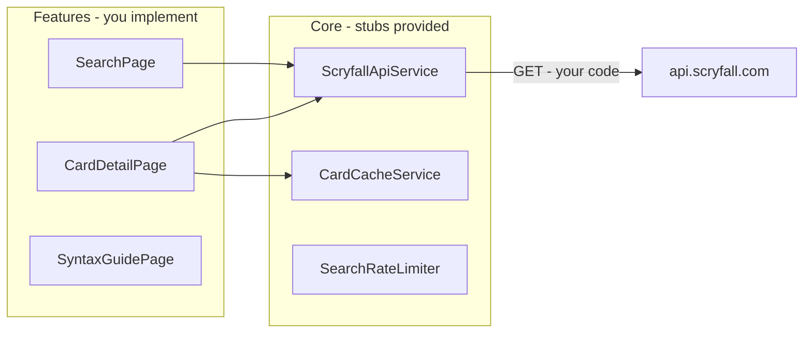

# Foil Vault Search — Angular Learning Scaffold Plan

## Primary goal

This is a **learning exercise**, not a finished product. The agent scaffolds **boilerplate only** so you can implement the Scryfall API integration and UI yourself in TypeScript.

**Agent delivers:** project structure, routing, types, stub services, placeholder templates, fixtures, test boilerplate, and guided exercise docs.

**You implement:** HTTP calls, component logic, templates styling, caching, debouncing, error handling, test cases, and polish.

---

## Scope and assumptions

- **Project path:** [`~/pers/foil-vault-search`](~/pers/foil-vault-search) (Windows: `C:\Users\alexl\pers\foil-vault-search`).
- **Language:** TypeScript throughout with `strict: true`.
- **API:** `https://api.scryfall.com` (direct browser calls; no backend/database).
- **UI library:** Angular Material (imported in components; you wire up the templates).
- **Runs on `ng serve`:** app compiles, routes work, placeholders visible — features show TODO states until you implement them.

---

## Scaffold vs. your implementation

| Area | Scaffolded (agent) | Your exercise |
|---|---|---|
| Project + Material setup | Yes | — |
| Folder structure + lazy routes | Yes | — |
| `ScryfallCard`, `ScryfallList`, etc. interfaces | Yes (complete) | Extend if you need more fields |
| `ScryfallApiService` method signatures | Yes | Implement HTTP calls |
| `CardCacheService`, rate limiter | Stub classes + TODO comments | Implement (optional stretch goals) |
| Page/component files | Yes, with placeholder templates | Build real UI + logic |
| Syntax guide content | Skeleton data structure | Fill in examples + Try-it buttons |
| Working search/detail flow | No | Core learning goal |
| Test framework setup | Yes (Jasmine + Karma via Angular CLI) | — |
| Spec files (`.spec.ts`) | Yes — one per service/component, mostly `xit` stubs | Un-skip and implement as you learn |
| Test helpers + builders | Yes — shared utilities and fixture factories | Extend as needed |
| Passing tests | One smoke test only (app shell creates) | All meaningful assertions are your exercises |

---

## High-level architecture (target — you build toward this)



---

## Tech stack

| Layer | Choice |
|---|---|
| Language | TypeScript 5.x, strict mode |
| Framework | Angular 19+ (standalone components, signals recommended in exercises) |
| UI | Angular Material + CDK |
| HTTP | `provideHttpClient(withFetch())` — wired in `app.config.ts` |
| Routing | Lazy-loaded feature routes (working) |
| State | Signals + router query params (patterns documented; you implement) |
| Testing | **Jasmine** + **Karma** (Angular CLI default), `HttpClientTestingModule`, `RouterTestingHarness` |

---

## Project bootstrap (agent)

1. Create [`~/pers/foil-vault-search`](~/pers/foil-vault-search) via `create_project` + `move_agent_to_root`.
2. Generate app (includes Jasmine/Karma test setup by default):
   ```bash
   ng new foil-vault-search --directory . --routing --style=scss --ssr=false --strict
   ng add @angular/material
   ```
3. Verify `ng serve` and `ng test` run before adding scaffold files (`ng test --no-watch --browsers=ChromeHeadless` for CI-style check).

---

## Folder structure

```
src/app/
  core/
    constants/scryfall.constants.ts      # API_BASE_URL, SEARCH_PAGE_SIZE, RATE_LIMIT_MS
    interceptors/scryfall.interceptor.ts # Stub — TODO: Accept header if needed
    models/scryfall.types.ts             # Complete TypeScript interfaces
    services/
      scryfall-api.service.ts            # Stub methods with TODO + JSDoc hints
      card-cache.service.ts              # Stub — stretch goal
      search-rate-limiter.service.ts     # Stub — stretch goal
  features/
    search/
      search.routes.ts
      search.page.ts                     # Placeholder + TODO blocks
      components/
        search-bar/search-bar.component.ts
        card-grid/card-grid.component.ts
        card-tile/card-tile.component.ts
    card-detail/
      card-detail.routes.ts
      card-detail.page.ts
      components/
        card-image/card-image.component.ts
        card-faces/card-faces.component.ts
        card-legalities/card-legalities.component.ts
    syntax-guide/
      syntax-guide.routes.ts
      syntax-guide.page.ts
      syntax-sections.data.ts            # Skeleton only
  shared/
    components/app-shell/app-shell.component.ts  # Working toolbar + router-outlet
  testing/                               # Shared test utilities (not production code)
    builders/scryfall-card.builder.ts    # Fluent factory for test cards
    builders/scryfall-list.builder.ts
    helpers/http-test.helpers.ts         # expectOneScryfallSearch(), etc.
    helpers/router-test.helpers.ts       # navigateWithQueryParams(), etc.
    fixtures/                            # Typed copies of assets/fixtures for imports in specs
  app.routes.ts
  app.config.ts

src/assets/fixtures/                     # Sample JSON for offline UI dev
  search-response.sample.json
  card-detail.sample.json

EXERCISES.md                             # App implementation phases
EXERCISES-TESTING.md                     # Testing phases (parallel learning track)
README.md                                # Quick start + links to both exercise docs
```

---

## What each stub file contains

### Type models — [`scryfall.types.ts`](src/app/core/models/scryfall.types.ts) (complete)

Fully typed interfaces you can import everywhere:

- `ScryfallCard`, `ScryfallCardFace`, `ScryfallImageUris`
- `ScryfallList<T>` (paginated search response)
- `ScryfallError` (`object: 'error'`)
- `SearchOptions` (order, unique, page)
- `LegalityStatus`, `CardLayout` union types where useful

This removes guesswork while you learn Angular — you focus on *using* types, not researching Scryfall's JSON.

### API service stub — [`scryfall-api.service.ts`](src/app/core/services/scryfall-api.service.ts)

```typescript
@Injectable({ providedIn: 'root' })
export class ScryfallApiService {
  private readonly http = inject(HttpClient);

  /** TODO Exercise 2: GET /cards/search — see EXERCISES.md */
  searchCards(query: string, page = 1, options?: SearchOptions): Observable<ScryfallList<ScryfallCard>> {
    return throwError(() => new Error('TODO: Implement searchCards'));
  }

  /** TODO Exercise 5: GET /cards/:id */
  getCardById(id: string): Observable<ScryfallCard> {
    return throwError(() => new Error('TODO: Implement getCardById'));
  }
}
```

JSDoc on each method links to Scryfall docs, notes rate limits, and suggests RxJS operators (`debounceTime`, `switchMap`).

### Page components — placeholder pattern

Each page compiles and renders a Material card with:

- Screen title
- Short description of what you'll build
- Checklist of TODO items (mirrors `EXERCISES.md`)
- `@if (false)` commented example snippets (signals, `@for`, `routerLink`) as copy-paste starters — not active code

Example search page placeholder:

> "Implement search here. Wire `SearchBarComponent` output to `ScryfallApiService.searchCards()`. Display results in `CardGridComponent`."

### App shell — fully working (minimal)

The one complete vertical slice for navigation learning:

- `mat-toolbar` with app title **Foil Vault Search**
- `routerLink` buttons: Search | Syntax Guide
- `<router-outlet>` for lazy features
- Footer: Scryfall attribution link

You can click between routes immediately after scaffold.

### Fixtures — [`src/assets/fixtures/`](src/assets/fixtures/)

Trimmed real Scryfall JSON (1 search page + 1 DFC card) so you can:

- Build UI against static data first (`// TODO: remove fixture, use service`)
- Learn `@Input()` binding before HTTP is working
- Reuse the same data in specs via `testing/fixtures/` imports

---

## Testing scaffold (agent delivers boilerplate)

Angular CLI ships with **Jasmine** (assertions), **Karma** (test runner), and `@angular/core/testing` (TestBed). The agent adds a parallel learning track so you learn testing alongside features — not as an afterthought.

### Test file coverage — every `.ts` gets a `.spec.ts`

| File | Spec stub contents |
|---|---|
| `scryfall-api.service.ts` | `describe` block, `HttpClientTestingModule`, 3–4 `xit` tests with TODO comments |
| `card-cache.service.ts` | `xit` stubs for get/set/evict |
| `search-rate-limiter.service.ts` | `xit` stub for queue timing (stretch) |
| `app-shell.component.ts` | **1 passing** smoke test (`should create`) — proves TestBed works |
| `search.page.ts` | `xit` stubs: renders placeholder, calls service on search |
| `search-bar.component.ts` | `xit` stubs: emits query, debounce behavior |
| `card-grid.component.ts` | `xit` stubs: renders N tiles from `@Input` |
| `card-tile.component.ts` | `xit` stubs: displays name, emits click |
| `card-detail.page.ts` | `xit` stubs: reads route param, loads card |
| `card-image`, `card-faces`, `card-legalities` | `xit` stubs for presentational assertions |
| `syntax-guide.page.ts` | `xit` stubs: renders sections, Try-it navigation |

### Spec stub pattern (consistent across project)

Each spec file follows the same learning-friendly shape:

```typescript
describe('ScryfallApiService', () => {
  let service: ScryfallApiService;
  let httpMock: HttpTestingController;

  beforeEach(() => {
    TestBed.configureTestingModule({
      providers: [provideHttpClient(), provideHttpClientTesting()],
    });
    service = TestBed.inject(ScryfallApiService);
    httpMock = TestBed.inject(HttpTestingController);
  });

  afterEach(() => httpMock.verify());

  it('should be created', () => {
    expect(service).toBeTruthy(); // only pre-enabled test in service specs
  });

  // TODO(test-learn): Un-skip after implementing searchCards in Phase 2
  xit('searchCards should GET /cards/search with encoded query', () => {
    // HINT: use ScryfallListBuilder and expectOneScryfallSearch helper
    fail('TODO: Implement this test');
  });
});
```

- **`it`** — enabled only for "should create" smoke tests
- **`xit`** — skipped exercise tests you un-skip as you implement features
- **`fail('TODO: …')`** — if accidentally un-skipped early, test fails with a clear message

### Test helpers — [`src/app/testing/`](src/app/testing/)

**Builders** (fluent API for readable specs):

```typescript
// usage: ScryfallCardBuilder.create().withName('Lightning Bolt').build()
ScryfallCardBuilder.create()
  .withId('abc-123')
  .withName('Lightning Bolt')
  .withImageUris({ small: '...', normal: '...' })
  .build();
```

**HTTP helpers** — [`http-test.helpers.ts`](src/app/testing/helpers/http-test.helpers.ts):

- `expectOneScryfallSearch(httpMock, query, page?)` — wraps `expectOne` with URL matching
- `expectOneScryfallCard(httpMock, id)` — for detail endpoint
- `flushScryfallError(httpMock, message)` — simulates zero-results error body

**Router helpers** — [`router-test.helpers.ts`](src/app/testing/helpers/router-test.helpers.ts):

- `setupRouterTesting()` — returns configured `RouterTestingHarness` for a route
- `navigateWithQueryParams(harness, '/search', { q: 'c:red' })`

All helpers are fully implemented (small, generic utilities). **Your exercise is writing the specs that use them**, not building the helpers themselves.

### EXERCISES-TESTING.md — parallel testing phases

| Phase | When | Goal |
|---|---|---|
| T0 | Day 1 | Run `ng test`, understand TestBed, read one spec stub |
| T1 | After app Phase 1 | Un-skip `getCardById` service test; mock HTTP with `HttpTestingController` |
| T2 | After app Phase 2 | Un-skip `searchCards` tests — success + `ScryfallError` case |
| T3 | After app Phase 3 | Component tests: `CardTileComponent` renders `@Input`, `SearchBarComponent` emits |
| T4 | After app Phase 4 | Router tests: query params sync, navigation with state |
| T5 | After app Phase 5 | `CardDetailPage` integration test with mocked service + route param |
| T6 | Stretch | Cache service tests, debounce timing (`fakeAsync` + `tick`), rate limiter |

Each testing phase includes: **Prerequisites** (which app phase must be done), **Files to edit**, **Concepts** (e.g. `HttpClientTestingController`, `ComponentFixture`, `DebugElement`, `fakeAsync`), **Hints**, **Verify** (`ng test` all green for un-skipped tests).

### Testing conventions (match app stubs)

- `// TODO(test-learn):` — your test implementation task
- `// HINT:` — suggested matcher or setup
- `xit` / `xdescribe` — skipped until you're ready (rename to `it` / `describe`)
- Prefer **Arrange / Act / Assert** comments in longer tests
- No snapshot testing — focus on behavior assertions useful for learning

### What tests the agent will NOT write

- Full test suites with all assertions implemented
- E2E / Playwright / Cypress (out of scope — unit/component only)
- Tests that hit the real Scryfall API (always mock HTTP in unit tests)

---

## Routing (scaffolded, working)

| Route | Lazy load | Initial state |
|---|---|---|
| `''` → `/search` | — | redirect |
| `/search` | `search.routes.ts` | Placeholder page |
| `/card/:id` | `card-detail.routes.ts` | Placeholder page (reads `:id` param, displays it) |
| `/syntax` | `syntax-guide.routes.ts` | Skeleton sections list |
| `**` → `/search` | — | fallback |

Card detail placeholder proves `ActivatedRoute` param reading works — you replace the rest.

---

## Screen specs (your implementation targets)

Use these as requirements in `EXERCISES.md`; agent does **not** build them out.

### 1. Main search (`/search`)

**You implement:**
- `mat-form-field` search input with debounce (~300ms)
- Call `ScryfallApiService.searchCards()`
- Sync `q` and `page` to URL query params
- `mat-paginator` (175 cards/page from Scryfall)
- Grid of card tiles with lazy-loaded images
- Loading, empty, and error states
- Click tile → `/card/:id` with optional router state

**Learning topics:** `HttpClient`, signals/computed, `@for` + `track`, query params, Material form field.

### 2. Card detail (`/card/:id`)

**You implement:**
- Load card from router state, cache, or API (in that order)
- Render single- and double-faced layouts
- Legalities table, metadata, external Scryfall link
- Back navigation preserving search context

**Learning topics:** route params, `Router` state, conditional templates, child components.

### 3. Syntax guide (`/syntax`)

**Scaffold provides:** `SyntaxSection[]` type + empty section titles.

**You implement:**
- Fill in descriptions and example queries per section
- Section nav + "Try it" → `/search?q=...`
- Link to [Scryfall syntax docs](https://scryfall.com/docs/syntax)

**Learning topics:** static data modules, `routerLink` with query params, content layout.

---

## EXERCISES.md — phased learning path (agent writes this)

### Phase 0 — Orientation
- Run `ng serve`, explore folder structure, read `scryfall.types.ts`
- Navigate between routes; find TODO comments

### Phase 1 — First HTTP call
- Implement `getCardById()` only
- Temporarily call it from card-detail placeholder; log response to console
- **Concepts:** `inject()`, `HttpClient.get`, typed `Observable`, async pipe or `subscribe`

### Phase 2 — Search API
- Implement `searchCards()` with query encoding
- Handle `ScryfallError` (zero results returns error object, not empty list)
- Display raw JSON or a simple list — UI polish comes later

### Phase 3 — Search UI
- Build `SearchBarComponent` with `output()` or `@Output`
- Bind results to `CardGridComponent` / `CardTileComponent`
- Use fixture JSON first, then swap to live API

### Phase 4 — Routing and URL state
- Query param sync on `/search`
- Navigate to card detail with state
- Deep link `/card/:id` without state (API fallback)

### Phase 5 — Card detail UI
- Split into presentational components
- Handle `card_faces` for DFC/split cards
- Material layout for legalities

### Phase 6 — Syntax guide
- Populate `syntax-sections.data.ts`
- Wire Try-it navigation

### Stretch goals (optional)
- Debounce + rate limit queue (500ms between searches)
- In-memory LRU cache
- `OnPush` change detection
- Loading skeletons and error retry
- Complete remaining `xit` tests in `EXERCISES-TESTING.md` Phase T6

Each phase includes: **Goal**, **Files to edit**, **Hints**, **Verify**, **Docs links**.

See also **`EXERCISES-TESTING.md`** for the parallel testing track (un-skip specs as you complete each app phase).

---

## Scryfall API reference (for your exercises)

| Endpoint | Rate limit | Notes |
|---|---|---|
| `GET /cards/search?q=&page=` | 2/sec | 175 cards per page; encode `q` |
| `GET /cards/:id` | 10/sec | UUID from search results |
| Images on `*.scryfall.io` | none | Use `image_uris.small` / `normal` |

Required: HTTPS, valid `Accept` header in browser (usually automatic). Do not override `User-Agent` in browser JS.

---

## Stub coding conventions

- `// TODO(learn):` — your implementation task
- `// HINT:` — suggested approach, not a spoiler
- `// EXAMPLE (disabled):` — commented reference snippet you can uncomment
- Services throw clear `'TODO: …'` errors until implemented (fail loudly during dev)
- No hidden "solution branch" — the repo stays exercise-clean
- Spec files use `xit` for exercises; only smoke `it('should create')` tests pass initially

---

## What the agent will NOT do

- Fully implement API calls or production UI
- Add NgRx or a backend
- Pre-complete cache/rate-limiter logic (stubs only)
- Over-polish styling — minimal Material defaults are enough

---

## Agent implementation order

1. Bootstrap project + Material + strict TypeScript
2. Create folder structure, constants, complete type models
3. Stub services + interceptor skeleton
4. JSON fixtures from Scryfall samples
5. Working app shell + lazy routes
6. Placeholder feature pages and empty child components (compile-ready)
7. Syntax data skeleton
8. **Testing scaffold:** `testing/` helpers + builders, `.spec.ts` stub for every service/component
9. `EXERCISES.md` + `EXERCISES-TESTING.md` + update `README.md`
10. Verify: `ng build` passes, `ng test --no-watch --browsers=ChromeHeadless` passes (smoke tests only), all routes navigable

---

## Success criteria for scaffold delivery

- `ng serve` runs without errors
- `ng test` runs green with only smoke tests enabled (skipped `xit` tests do not fail the suite)
- All three routes load placeholder content
- TypeScript strict mode passes
- Every exercise file has clear TODO markers
- Every service/component has a matching `.spec.ts` with documented `xit` stubs
- `EXERCISES-TESTING.md` maps test phases to app implementation phases
- You can start Phase 1 (app) and T0 (testing) immediately without restructuring the project
